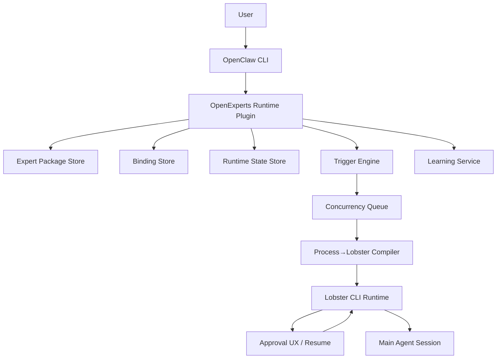

# OpenClaw Plugin Runtime Plan

## Goals

- Ship a first working `openexperts-runtime` plugin under `packages/openclaw-plugin` that OpenClaw can install and run.
- Preserve OpenExperts spec semantics from `spec.md` while using OpenClaw-native plugin mechanics.
- **Use Lobster** as the process execution and approval engine — not a custom executor.
- Deliver the user flow: install runtime once, install experts, bind tools, activate, run, and support approval-gated learnings.

## Docs Validation Summary

The plan and spec were validated against the full OpenClaw documentation. Key findings:

### Confirmed correct (no changes needed)
- Plugin manifest format (`openclaw.plugin.json` with `id` + `configSchema`)
- CLI command registration via `api.registerCli()`
- Plugin hooks (`before_prompt_build`, `before_tool_call`, `message_received`, etc.)
- Isolated vs. main session model (cron: `cron:<jobId>`, hooks: `hook:<uuid>`)
- Cron trigger wiring (built-in scheduler with 5/6-field expressions, IANA tz, delivery routing)
- Webhook trigger wiring (`/hooks/agent` endpoint, custom mappings, presets like `gmail`)
- Skills integration (plugins can ship skills via manifest `skills` array)
- Agent tools registration (`api.registerTool()` with TypeBox schemas)
- Background services (`api.registerService()` with start/stop lifecycle)

### Adjusted (feasible but custom)
- **Storage paths**: Using `~/.openclaw/openexperts/` as plugin data root (non-standard but fine — expose via `configSchema`)
- **Concurrency (serial_per_key)**: Not natively supported — plugin must implement its own per-key queue manager via `api.registerService()`
- **Dedupe**: No built-in dedup — plugin maintains an LRU/TTL seen-keys map
- **Channel triggers**: Use `message_received` plugin hook to match messages against expert trigger defs
- **State file lifecycle**: Plugin-managed reset of `scope: session` templates
- **Delivery format (narrative/structured)**: Custom formatting in plugin delivery handler
- **Execution log / resume**: Plugin-owned — inject via `before_prompt_build` on retry

### Constraints discovered (final sweep)
- **System prompt budget**: Bootstrap files capped at 20,000 chars/file, 150,000 total. Our `before_prompt_build` injection is separate from bootstrap but still counts toward context window. Expert prompt assembly (persona + orchestrator + indexes + policy) must be size-conscious.
- **Sub-agent prompt mode**: `sessions_spawn` uses `promptMode: "minimal"` — omits Skills, Memory Recall, Self-Update, etc. Sub-agents only inject `AGENTS.md` + `TOOLS.md`. Our `before_prompt_build` hook still fires and can inject expert context, which is the correct pattern.
- **`llm-task` enablement**: Must be enabled via `plugins.entries.llm-task.enabled: true` AND added to agent tool allowlist. `expert doctor` must check both.
- **Sandbox compatibility**: If sandbox is enabled, default network is `"none"` (no egress) and host env vars are not inherited. MCP server calls and external tool auth may fail. Plugin should warn at `expert doctor` if sandbox is active without network config.
- **Tool filtering 8-level chain**: Tool profile → provider profile → global policy → provider policy → agent policy → agent provider policy → sandbox policy → subagent policy. Bound expert tools must pass all levels.
- **Session serialization (free)**: OpenClaw serializes runs per session key via lane-based queuing. Our custom concurrency queue operates above this — for trigger-level and entity-level coordination.
- **Model failover (free)**: Built-in auth profile rotation + model fallback. No custom failover needed for expert sessions.
- **Gmail preset payload shape**: `messages[0].id`, `.from`, `.subject`, `.snippet`, `.body` — matches spec example's `payload_mapping`.
- **Subagent concurrency**: Dedicated `subagent` lane with `maxConcurrent: 8` (default). Expert sessions spawned via `sessions_spawn` share this lane.
- **Memory system is separate**: OpenClaw's memory (`MEMORY.md`, `memory/*.md`, `memory_search`) is orthogonal to our learnings system. Could optionally add learnings to `memorySearch.extraPaths` for cross-expert discoverability (post-v1).

### Architecture change: Lobster replaces custom executor
- **Approval system**: ~~Cannot rely on `before_tool_call` for pause/approve/reject~~ → Use Lobster's native `approval: required` steps + `resumeToken` for confirm/manual tiers
- **Process execution**: ~~Build custom process executor~~ → Compile spec processes into `.lobster` workflow files; run via the Lobster tool
- **Resume**: ~~Custom execution log~~ → Lobster resume tokens handle paused/failed workflow state
- **Tool operations**: Use `openclaw.invoke --tool <name>` inside Lobster steps for bound tool calls
- **LLM judgment steps**: Use `llm-task` plugin within Lobster pipelines for functions like classify-email-intent

## Scope Decisions

- Include in v1: install/list/validate/bind/activate/run, trigger wiring, Lobster-based process execution, approval enforcement via Lobster, learning lifecycle.
- Exclude for now: private knowledge guardrails, dry-run mode, batch approvals.
- **New dependency**: Lobster CLI must be installed on the Gateway host. The plugin should validate this at `openclaw expert doctor` time.

## Proposed Plugin Architecture



## Package Structure To Create

- Plugin root: `packages/openclaw-plugin`
- Runtime modules:
  - `src/index.ts` (plugin entry, registration)
  - `src/cli/*.ts` (`openclaw expert ...` commands)
  - `src/spec/manifest.ts` (parse/validate `expert.yaml`)
  - `src/spec/components.ts` (function/process/tool loading)
  - `src/bindings/*.ts` (binding model + validation + operation mapping)
  - `src/state/*.ts` (state/scratch/learnings paths + lifecycle)
  - `src/runtime/lobster-compiler.ts` (process → `.lobster` workflow file generation)
  - `src/runtime/approvals.ts` (Lobster resume token management + confirm/manual UX)
  - `src/runtime/triggers.ts` (webhook/cron/channel registration)
  - `src/runtime/concurrency.ts` (parallel/serial/serial_per_key queue)
  - `src/runtime/learning.ts` (proposal/approval/persist/inject)
  - `src/runtime/prompt.ts` (system prompt assembly + policy rendering)
  - `src/registry/experts-md.ts` (main-agent registry generation)

## Milestones

### 1) Plugin Skeleton + Command Surface

- Add `openclaw.plugin.json` with plugin `id: "openexperts-runtime"` and `configSchema` (expert data dir, defaults).
- Export plugin registration function using `api.registerCli()`, `api.registerService()`, and plugin hooks.
- Register CLI commands:
  - `openclaw expert install <source>`
  - `openclaw expert list`
  - `openclaw expert validate <name>`
  - `openclaw expert bind <name> <tool> --mcp <server> | --skill <skill>`
  - `openclaw expert activate <name>`
  - `openclaw expert run <name> "<message>"`
  - `openclaw expert setup` (one-time: installs Lobster CLI, enables dependencies, configures allowlists)
  - `openclaw expert doctor` (checks Lobster CLI on PATH, plugin health, config correctness)
- Implement `openclaw expert setup` that:
  - Checks for Lobster CLI on PATH; if missing, installs from `github.com/openclaw/lobster`
  - Enables `llm-task` plugin in config (`plugins.entries.llm-task.enabled: true`)
  - Adds `lobster` and `llm-task` to tool allowlist (`tools.alsoAllow`)
  - Enables hooks if any expert has webhook triggers (`hooks.enabled: true`)
  - Prompts for hooks token if not set
  - Prints summary of what was configured and whether a gateway restart is needed
- Add minimal plugin config shape:
  ```json
  {
    "configSchema": {
      "type": "object",
      "properties": {
        "dataDir": { "type": "string", "default": "~/.openclaw/openexperts" },
        "lobsterTimeout": { "type": "number", "default": 600000 },
        "dedupeWindowMs": { "type": "number", "default": 3600000 }
      }
    }
  }
  ```

### 2) Package Install + Discovery

- Implement `expert install` with source resolver:
  - GitHub URL → `git clone` into `{dataDir}/experts/<name>/`
  - npm package → `npm pack` + extract
  - Local path → copy or symlink (`--link`)
- Persist package under `{dataDir}/experts/<expert-name>/`.
- Implement installed expert discovery by scanning `*/expert.yaml`.
- Implement `expert list` showing name, version, status (installed/bound/active), trigger count.

### 3) Spec Validation Engine

- Implement load-time validations aligned with spec section 14:
  - **Error**: `expert.yaml` missing/malformed, required fields absent, component paths missing, `triggers[].process` unresolved, function/process `tools[]` not in `requires.tools`, `learning.approval` invalid value
  - **Warn**: process `trigger` field unresolved, process `functions[]` unresolved, function `knowledge[]` unresolved, `policy.approval.overrides` keys unresolved
- Two-phase validation:
  - Phase 1 — Package structure (spec section 14)
  - Phase 2 — Binding validation (OpenClaw-specific: MCP reachability, skill eligibility)
- Emit structured error/warn results for CLI display and `expert doctor`.

### 4) Binding Wizard + Validation

- Store bindings at `{dataDir}/expert-config/<expert>/bindings.yaml` (outside package dir).
- Interactive `expert bind` per `requires.tools`:
  - `--mcp <server>`: bind to configured MCP server + optional operation mapping
  - `--skill <skill>`: bind to ClawHub or local skill
- Validate:
  - MCP server is configured in OpenClaw and reachable
  - Skill is installed and passes gating checks (bins, env, config)
  - Operation names match between tool YAML and implementation (warn on mismatch)
- Support operation mapping override for name mismatches:
  ```yaml
  tools:
    crm:
      type: mcp
      server: hubspot-mcp
      operations:
        get_contact: hubspot_get_contact_by_email
  ```

### 5) Process → Lobster Compiler

**This is the key new milestone.** The compiler translates spec process markdown into executable `.lobster` workflow files.

- Parse process frontmatter (`name`, `trigger`, `inputs`, `outputs`, `functions`, `tools`, `scratchpad`, `execution`, `delivery`, `context`).
- Parse process body to extract ordered step checklist (`- [ ] Step ...`).
- **Context preloading**: If the process declares a `context` array (e.g., `context: [state/pipeline.md, knowledge/meddpicc.md]`), generate initial steps that read these files and make their contents available to downstream steps.
- For each step, determine the step type:
  - **Tool call** (e.g., "Fetch email using the `email` tool") → `openclaw.invoke --tool <bound-tool-name> --action <operation>`
  - **Function invocation** (e.g., "Read and apply `classify-email-intent`") → `openclaw.invoke --tool llm-task --action json` with function body as prompt + declared inputs/outputs as schema. **Inject relevant learnings** into the `llm-task` prompt if `learning.enabled` (from `learnings/_package.md` + `learnings/{function-name}.md`).
  - **State read/write** (e.g., "Open scratchpad", "Update state/pipeline.md") → `exec --shell 'cat ...'` / `exec --shell 'openclaw.invoke --tool write ...'`
- Insert `approval: required` on steps that invoke tool operations at `confirm` or `manual` tier (resolved from `policy.approval`).
- For `manual` tier: step always pauses; the preview is the draft. The plugin never sends `approve: true` — the human executes it themselves.
- Wire `stdin: $step.stdout` / `stdin: $step.json` for data flow between steps.
- Add `condition: $step.approved` gates after approval steps.
- **`session: isolated` functions**: Functions that declare `session: isolated` cannot be inlined as `llm-task` steps. Generate a separate nested Lobster workflow for the function; only declared `outputs` are returned to the parent pipeline.
- **Escalation on low confidence**: If `policy.escalation.on_low_confidence` is `true`, add a post-function step that checks the `confidence` output (if declared) and escalates to the main agent if `low`.
- Generate `.lobster` files at `{dataDir}/compiled/<expert>/<process-name>.lobster`.
- Recompile on package update or binding change.

Example compiled output:
```yaml
name: inbound-email-triage
args:
  message_id:
    type: string
steps:
  - id: scratchpad
    command: openclaw.invoke --tool write --args-json '{"path":"scratch/triage-$message_id.md","content":"# Triage\n"}'
  - id: fetch_email
    command: openclaw.invoke --tool nylas_get_email --args-json '{"message_id":"$message_id"}'
  - id: fetch_contact
    command: openclaw.invoke --tool attio_find_person --args-json '{"email":"$fetch_email.json.sender"}'
    stdin: $fetch_email.json
  - id: fetch_deal
    command: openclaw.invoke --tool attio_list_deals --args-json '{"contact_id":"$fetch_contact.json.contact_id"}'
    stdin: $fetch_contact.json
  - id: classify
    command: openclaw.invoke --tool llm-task --action json --args-json '{"prompt":"...classify-email-intent body...","input":{"email_body":"$fetch_email.json.body","sender_context":"$fetch_contact.json"},"schema":{...}}'
    stdin: $fetch_contact.json
  - id: next_action
    command: openclaw.invoke --tool llm-task --action json --args-json '{"prompt":"...determine-next-action body...",...}'
    stdin: $classify.json
  - id: compose
    command: openclaw.invoke --tool llm-task --action json --args-json '{"prompt":"...compose-response body...",...}'
    stdin: $next_action.json
  - id: send_email
    command: openclaw.invoke --tool nylas_send_email --args-json '{"draft":"$compose.json.draft"}'
    stdin: $compose.json
    approval: required  # manual tier — always pauses, user executes themselves
  - id: create_note
    command: openclaw.invoke --tool attio_create_note --args-json '{"contact_id":"$fetch_contact.json.contact_id","body":"Triage: $classify.json.intent"}'
    stdin: $classify.json
```

### 6) Runtime Core — Triggers, State, Prompt Assembly

**Trigger wiring** via OpenClaw native mechanisms:

- **`cron`**: Use `cron.add` Gateway API to register jobs. Map spec trigger fields:
  - `expr` + `tz` → `schedule.kind: "cron"` + `schedule.expr` + `schedule.tz`
  - `session: isolated` → `sessionTarget: "isolated"` (default)
  - `session: main` → `sessionTarget: "main"` with `payload.kind: "systemEvent"`
  - Delivery → `delivery.mode: "announce"` + channel routing
- **`webhook`**: Use OpenClaw's `hooks.mappings` for preset-based triggers (e.g., `gmail`). For `requires_tool` triggers, register custom webhook mappings that invoke the expert's process.
- **`channel`**: Use `message_received` plugin hook. Match incoming messages against expert trigger definitions. Dispatch to the process on match.

**Concurrency queue** (custom, via `api.registerService()`):

- Maintain per-trigger invocation queues in memory (with overflow to disk).
- `parallel`: dispatch immediately.
- `serial`: global FIFO per trigger.
- `serial_per_key`: per-key FIFO. Resolve `concurrency_key` against (enriched) payload. Fall back to `serial` if key unresolvable + warn.

**Dedupe** (custom):

- LRU map with configurable TTL window (`dedupeWindowMs`).
- Key = `{trigger_name}:{dedupe_key_value}`.
- Persist to disk for crash recovery.

**State initialization**:

- On first activation: copy state templates from package to `{dataDir}/state/<expert>/`.
- On each session spawn: reset `scope: session` files to template contents; leave `scope: persistent` as-is.
- `scratch/` directory auto-created on first process write; cleaned up on success; preserved on failure with retry pending.

**Prompt assembly** (via `before_prompt_build` plugin hook):

- Inject as `prependContext`: persona, orchestrator, function/process/knowledge indexes, resolved approval tiers, state file paths, learnings.
- Use the same prompt structure as `loader-design.md` section 2.
- For isolated expert sessions, the expert context is injected alongside the minimal bootstrap (`AGENTS.md` + `TOOLS.md` only, since sub-agents use `promptMode: "minimal"`).
- **Context budget**: Track total injected chars. Warn at activation if expert prompt exceeds 20,000 chars (single bootstrap file limit). Persona + orchestrator are always fully loaded; function/knowledge indexes should be compact (name + 1-line description). If total expert context approaches model context limits, consider truncating knowledge indexes or deferring to on-demand reads.
- **Learnings injection**: Append relevant learnings (`_package.md` + `{function-name}.md`) to the `prependContext` before function-heavy processes. Size-cap learnings injection to avoid crowding the context window.
- **Private knowledge exclusion**: Knowledge files with `type: private` must NOT appear in package indexes, `EXPERTS.md` registry, debug logs, or any output that leaves the runtime boundary. They can be loaded into agent context at execution time but are excluded from all external-facing summaries.

### 7) Approval System (Lobster-Based)

The approval system is **entirely handled by Lobster** at the workflow level:

- **`auto`** tier: step has no `approval` field — Lobster executes immediately.
- **`confirm`** tier: step has `approval: required`. Lobster pauses and returns a `resumeToken` + preview. The plugin:
  1. Receives the `needs_approval` response from Lobster.
  2. Delivers the approval request inline in the main chat channel (operation name, inputs, expert reasoning).
  3. Registers an auto-reply command `/approve <token-id>` and `/reject <token-id>` via `api.registerCommand()`.
  4. On approve: calls `lobster resume --token <token> --approve true`.
  5. On reject: calls `lobster resume --token <token> --approve false`, treats as failed step → follows `on_failure`.
  6. If `policy.approval.timeout` is set, starts a timer via the background service. On expiry, applies `on_timeout` (`reject` or `escalate`).
- **`manual`** tier: step has `approval: required` and is **never resumed**. The preview IS the draft. Plugin delivers the draft to the main chat with a "DRAFT — for your review" label and marks the step complete.

Approval token management:

- Store pending approvals at `{dataDir}/approvals/pending.json`.
- Background service polls for timed-out approvals.
- Structured approval events emitted for future UI consumption.

### 8) Learning System

The learning system is entirely plugin-managed (OpenClaw has no native equivalent):

- Respect `learning.enabled`, `learning.approval`, `max_entries_per_file`.
- Create/maintain:
  - `{dataDir}/learnings/<expert>/_package.md`
  - `{dataDir}/learnings/<expert>/{function-name}.md`
- Implement learning lifecycle:
  1. **Observe**: Use `after_tool_call` hook and `agent_end` hook to detect correction opportunities.
  2. **Propose**: Agent drafts a learning with scope (`package` or function name).
  3. **Approve**: Enforce `learning.approval` tier — `auto` persists immediately, `confirm` asks user in chat (reuse approval UX), `manual` delivers for human review.
  4. **Persist**: Append to matching learnings file. Enforce `max_entries_per_file` with FIFO archival.
  5. **Inject**: Before function execution, use `before_prompt_build` to inject relevant learnings from `_package.md` + `{function-name}.md`.
- Keep learnings isolated per expert namespace.

### 9) Main-Agent Registry + End-to-End Verification

- Generate/update `EXPERTS.md` in the main agent workspace for routing (per loader-design.md section 7).
- `openclaw expert doctor` checks:
  - Lobster CLI on PATH and responds to `lobster --version`
  - `llm-task` plugin enabled (`plugins.entries.llm-task.enabled`) AND in agent tool allowlist
  - `lobster` tool enabled in agent tool allowlist (via `tools.alsoAllow: ["lobster"]` or equivalent)
  - Sandbox compatibility: warn if sandbox enabled with `network: "none"` (MCP/external tools won't work)
  - All experts validated (package + bindings)
  - Triggers registered (cron jobs exist, webhook mappings configured)
  - Compiled `.lobster` files up to date (hash check against source processes + bindings)
  - Expert prompt size within budget (warn if persona + orchestrator + indexes exceed 20k chars)
- End-to-end scenario tests:
  - install → bind → activate → verify triggers registered
  - Cron trigger → Lobster pipeline execution → delivery to main session
  - Webhook trigger → dedupe → concurrency → Lobster execution
  - `confirm` approval → pause → `/approve` → resume → completion
  - `manual` approval → draft delivered → step marked done
  - Learning proposal → approval → persistence → injected on next run
  - Failure → retry with backoff → scratchpad preservation → resume

## Acceptance Criteria

- OpenClaw can install and enable plugin successfully.
- `openclaw expert doctor` reports Lobster CLI available and plugin healthy.
- User can complete `openclaw expert install` → `bind` → `activate` flow for a sample expert package.
- Activation fails fast with actionable validation errors when package/bindings are invalid.
- Spec processes are compiled into valid `.lobster` workflow files with correct approval gates.
- Triggered process execution honors concurrency, retries, approvals (via Lobster), and delivery settings.
- `confirm`-tier operations pause via Lobster, present in chat, and resume on `/approve`.
- `manual`-tier operations deliver drafts and never execute.
- Learning entries are approval-gated, persisted, and injected into subsequent executions.
- Learnings are isolated per expert package.

## Risks and Mitigations

- **Lobster CLI availability**: Plugin requires Lobster on PATH. `openclaw expert setup` auto-installs it from the [openclaw/lobster](https://github.com/openclaw/lobster) repo. `expert doctor` verifies it's present and responsive. If auto-install fails (permissions, platform), provide manual install instructions.
- **Process compilation fidelity**: The compiler targets the checklist pattern (`- [ ] Step ...`) which the spec requires for resumable processes (section 7). Processes without checklists are not spec-compliant for resumable execution; the compiler should reject them with a clear error pointing to the spec requirement.
- **`llm-task` dependency**: Functions with complex judgment run via `llm-task` inside Lobster. Must be enabled (`plugins.entries.llm-task.enabled`) AND in tool allowlist. `expert doctor` checks both. If missing, activation fails with clear remediation steps.
- **Sandbox incompatibility**: If sandbox is enabled with `network: "none"` (default), MCP server calls and external API tools will fail silently. `expert doctor` warns if sandbox is active. Document required sandbox config for expert packages (e.g., `sandbox.docker.network: "bridge"`).
- **Context budget overflow**: Expert packages with many functions, processes, and knowledge files could generate a prompt that exceeds the context window. Track injected size and warn at activation. Use compact indexes (name + 1-line description) and defer full content to on-demand reads.
- **Concurrency queue complexity**: `serial_per_key` requires robust in-memory + disk-backed queuing. Instrument with structured logs from day one. OpenClaw's per-session serialization handles some concurrency for free, but trigger-level and entity-level coordination is custom.
- **Approval UX deadlocks**: Lobster resume tokens have no built-in TTL. Plugin must manage its own timeout → rejection/escalation pathway via background service.
- **Tool filtering chain**: Bound expert tools (MCP servers, skills) must pass OpenClaw's 8-level tool filtering chain. If a tool is blocked by global policy, agent policy, or sandbox policy, the expert will fail at runtime. `expert validate` should check tool availability through the effective policy.
- **Learning quality drift**: Gate with `confirm` default and enforce entry format/size constraints per spec.
- **OpenClaw API surface mismatch**: Start with thin integration adapters and verify plugin hook contracts early. The `before_tool_call` hook docs are sparse on blocking semantics — test interception capabilities in milestone 1 to understand what's possible for learning observation.

## Key Dependencies

| Dependency | Type | Why |
|---|---|---|
| Lobster CLI | External binary on PATH | Process execution + approval gates + resume |
| `llm-task` plugin | OpenClaw plugin (opt-in, must be enabled + allowlisted) | Structured LLM steps within Lobster pipelines |
| `lobster` tool | OpenClaw plugin tool (opt-in, must be allowlisted) | Lobster pipeline invocation from agent sessions |
| OpenClaw cron API | Built-in Gateway (`cron.add/update/remove`) | Cron trigger registration and management |
| OpenClaw hooks system | Built-in Gateway (`hooks.mappings`, `hooks.presets`) | Webhook trigger wiring (Gmail preset, custom mappings) |
| `before_prompt_build` hook | Plugin hook | Inject expert context + learnings into sessions |
| `message_received` hook | Plugin hook | Channel trigger matching and dispatch |
| `after_tool_call` hook | Plugin hook | Learning observation (detect correction opportunities) |
| `agent_end` hook | Plugin hook | Learning observation (post-run analysis) |
| `gateway_start` hook | Plugin hook | Register triggers, start background services on boot |
| `api.registerCli()` | Plugin API | CLI command surface (`openclaw expert ...`) |
| `api.registerService()` | Plugin API | Background services (concurrency queue, approval timers, dedupe cleanup) |
| `api.registerCommand()` | Plugin API | `/approve` and `/reject` auto-reply commands |
| `api.registerTool()` | Plugin API | Optional expert-scoped proxy tools (if needed beyond Lobster) |
| `sessions_spawn` | Built-in tool | User-initiated expert invocation from main agent |
| OpenClaw memory system | Built-in (separate) | Orthogonal — learnings are plugin-managed, not memory plugin |

## OpenClaw Config Requirements

The following OpenClaw configuration is needed for the plugin to function:

```json5
{
  // Enable the openexperts-runtime plugin
  plugins: {
    entries: {
      "openexperts-runtime": { enabled: true, config: { /* dataDir, etc. */ } },
      "llm-task": { enabled: true },  // Required for function invocations in Lobster
    },
  },

  // Allow Lobster + llm-task tools for expert agent sessions
  tools: {
    alsoAllow: ["lobster", "llm-task"],
  },

  // Webhooks (if expert packages use webhook triggers)
  hooks: {
    enabled: true,
    token: "${OPENCLAW_HOOKS_TOKEN}",
    // presets and mappings added by plugin at activation time
  },

  // Cron (enabled by default, plugin registers jobs at activation)
  cron: {
    enabled: true,
  },
}
```
